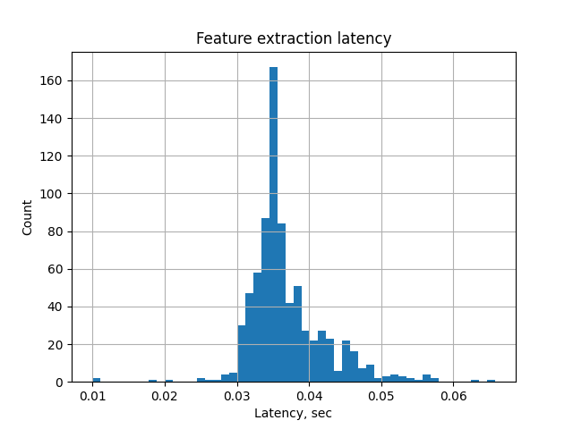
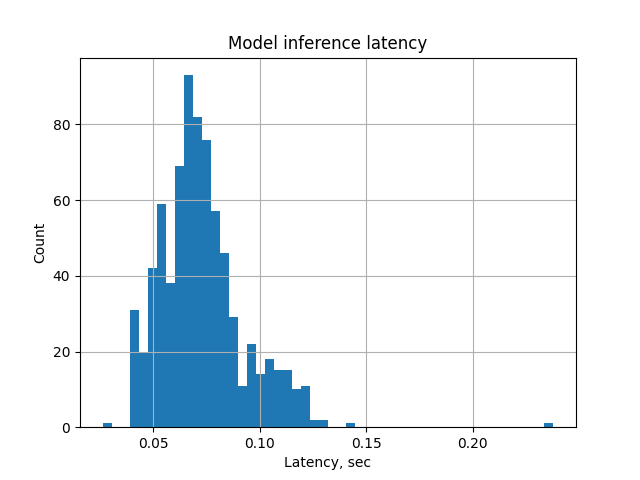

# RNN-T Emformer latency analysis

## Dataset
We use a small subset of 20 utterances from LibriSpeech-test, which we include into the repo.

## Installation and running

1. Create and activate virtual environment as follows:
`conda env create -f environment.yml -n myenv`
`conda activate myenv`
2. Run benchmark:
`python run_asr_analysis.py --beam-width 10`

## Latency Analysis

The latency of ASR consists of the following components:
 1. Algorithmic latency (ALGO_LAT) – the latency associated with past and future context necessary to run the inference.
For instance, the presented model uses 160 ms past context and 40 ms lookahead, which amounts to 200 ms of total algorithmic latency.
2. Feature extraction latency (FEAT_LAT) – the latency of converting audio signal into mel-filterbanks representation.
3. Model inference latency (INF_LAT) – the latency of running neural network computations and decoding.
4. Memory moving latency (MEM_LAT) – the latency of moving memory from CPU to GPU. Usually it is negligibly small.
5. There can be also a stabilization latency (STAB_LAT), which denotes the amount of time needed for a hypothesis 
to reliably converge so that it can be commited to the output in the form of partial result. 
In the scope of this work, we don't consider this type of latency as it has many nuances and depends on the decoding algorithm.

We have run the benchmark on the machine equipped with T4 GPU and default parameters from the above, and obtained the following latency numbers (in seconds):

**Algorithmic latency:** 0.2

**P95 inference latency:** 0.10991263389587401

**P95 feature extraction latency:** 0.0486887454986572

**P95 memory latency:** 5.970001220703122e-05

**Total latency:** 0.35866107940673825

**Real-time factor:** 0.5560858685985889

The latency distributions are presented below:

As we can see from the analysis above, the total latency amounts to **~360 ms**, 55% of which is attached to 
the algorithmic latency alone. For the computational latencies, we rely on 95-percentile figures, as they more naturally depict
the worst-case scenario which is crucial for user experience.

## Optimization proposals
**1. Algorithm latency reduction.**

We can reduce algorithic latency by reducing amount of past and future context.
This is possible by changing the architecture of the Emformer, therefore retraining will be required.
Shrinking the context size and lookahead will result in less accurate computations and will likely lead to an increase in WER (Word Error Rate)
and CER (Character Error Rate) metrics.

**2. Feature extraction latency reduction.** Currently, the feature extraction is implemented on CPU. Moving computations to GPU can significantly reduce
the latency figures. It seems that the current pytorch implementation doesn't support feature extraction of GPU for this particular model,
therefor we should use a 3rd-party or custom implementation.

**3. Model inference latency reduction**  Model quantization to **float16** or **int8** can help, but 
very likely the model should be retrained or fine-tuned with custom quantization-aware training methods, as the 
performance can significantly degrade otherwise.

